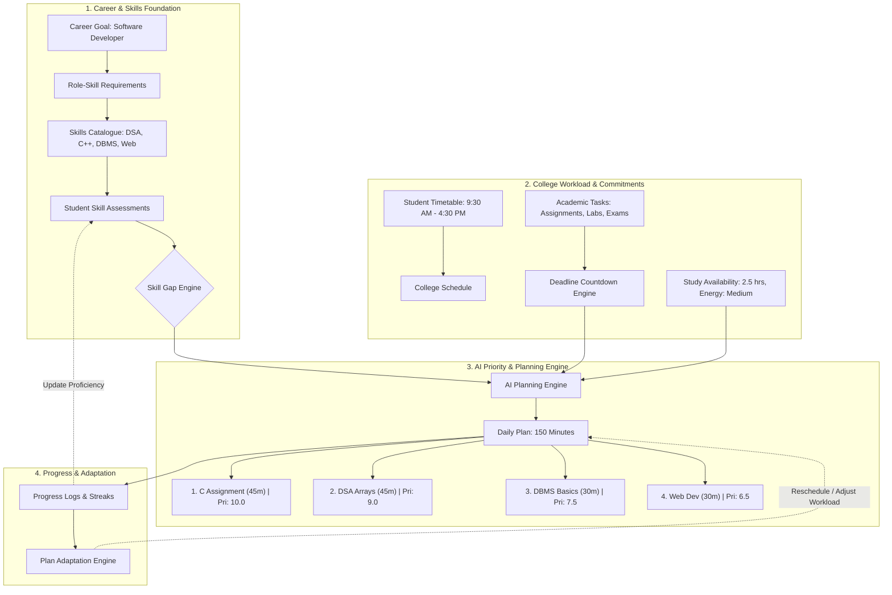
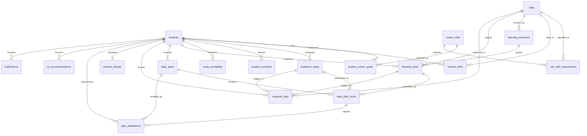

# Student Companion Database System
## Bridging the Gap Between College Work and Placement Preparation

An enterprise-grade, normalized **PostgreSQL** relational database system designed for an AI-powered student companion. The platform helps engineering and college students dynamically balance academic commitments (classes, lab records, assignments, internal exams) with high-priority internship and placement preparation (DSA, system design, core CS subjects, dev skills).

---

## 1. System Architecture & Product Flow

The core system implements an adaptive feedback loop connecting student career aspirations to granular, actionable daily study plans:



---

## 2. Complete Entity-Relationship (ER) Diagram



---

## 3. Database Schema Layout

The database consists of 5 modular scripts designed for clean deployment and testing:

| Script File | Purpose | Key Objects Created |
| :--- | :--- | :--- |
| `01_schema.sql` | Relational DDL & Constraints | 14 tables, UUID PKs, CHECK constraints, 18 composite indexes, triggers |
| `02_views_and_functions.sql` | Views & AI Functions | `v_student_skill_gaps`, `v_student_active_workload`, `v_student_weekly_progress`, `fn_get_ai_daily_plan_context` |
| `03_seed_data.sql` | Seed Dataset | Full profile for Demo Student, Software Developer curriculum, 16 skills, tasks, and today's plan |
| `04_example_queries.sql` | Verification Queries | The 12 product queries (career goals, skill gaps, deadlines, workload, progress) |
| `05_ai_planning_context.sql` | AI Decision Context | Master JSON compiler query answering the core product question |
| `init_database.sql` | Master Runner | Single psql pipeline running scripts 01 through 05 |

---

## 4. Architectural Justifications: Why Each Table Exists

### 1. `students`
- **Purpose**: Master entity for user identity, academic progress context, and baseline learning preferences.
- **Why it matters**: Stores college year, branch, daily study preferences (`preferred_study_hours_per_day`, `daily_available_prep_minutes`), and timezone. Allows the AI engine to personalize daily plans without querying external auth providers.

### 2. `career_roles`
- **Purpose**: Centralized registry of standard industry career positions (e.g., Software Developer, Data Scientist, AI/ML Engineer).
- **Why it matters**: Avoids storing free-text role strings. Decouples role expectations and required competencies so the curriculum can be updated by domain mentors without altering student records.

### 3. `student_career_goals`
- **Purpose**: Many-to-many junction table between students and career roles.
- **Why it matters**: Real-world students often explore primary and secondary goals (e.g., Primary: Software Developer, Secondary: Data Analyst). Supports priority ranking, target company tier (e.g., *Product-based*, *FAANG*), and placement cutoff dates.

### 4. `skills`
- **Purpose**: Normalized master list of tech and placement skills across 7 categories (*Programming*, *DSA*, *Development*, *Core CS*, *Aptitude*, *Interview*, *Soft Skills*).
- **Why it matters**: Prevents typographical variations ("C++" vs "cpp"). Enables tagging learning tasks, resources, and progress to single skill IDs.

### 5. `role_skill_requirements`
- **Purpose**: Skill matrix mapping career roles to required proficiencies (0 to 5), importance levels (*Critical*, *High*, *Medium*, *Low*), weight scores (1.0 to 10.0), and recommended learning sequences.
- **Why it matters**: Informs the AI engine of **why** a skill matters. For a Software Developer, DSA has weight 10.0 and proficiency 4 (Advanced), while Web Development has weight 6.5.

### 6. `student_skills`
- **Purpose**: Stores student's current proficiency (0–5), target proficiency, confidence level, and assessment source.
- **Why it matters**: Powers the **Skill Gap Engine**. By computing `required_proficiency - current_proficiency`, the AI identifies whether the student is at Beginner (1), Intermediate (3), or Not Started (0).

### 7. `academic_tasks`
- **Purpose**: Manages college academic obligations (Assignments, Lab records, Exams, Quizzes, Projects).
- **Why it matters**: **Strictly separated from placement prep tasks**. Academic tasks have rigid deadlines and external grade penalties. Stores subject, deadline timestamp, remaining minutes, and status (*In Progress*, *Overdue*).

### 8. `student_schedule`
- **Purpose**: Stores the student's fixed college timetable (e.g., Monday 9:30 AM – 4:30 PM: Math, C, Physics, Lab).
- **Why it matters**: Tells the AI when the student is physically busy in classes, preventing unrealistic plan suggestions during lecture hours.

### 9. `study_availability`
- **Purpose**: Daily study window declarations by the student (e.g., 2026-10-08: 6:30 PM – 9:00 PM, 150 min, Energy: *Medium*).
- **Why it matters**: Even if a student generally prefers 3 hours/day, today they may only have 2.5 hours due to exam fatigue. Energy level (*Low*, *Medium*, *High*) directs the AI whether to schedule hard algorithmic problem-solving or lighter reading.

### 10. `learning_resources`
- **Purpose**: Curated catalogue of learning materials (videos, courses, problem sets) mapped to specific skills with difficulty and duration.
- **Why it matters**: Supplies actionable learning items for skills where students have gaps.

### 11. `learning_tasks`
- **Purpose**: Actionable placement preparation items (e.g., "Practice 5 Array Problems", "Study DBMS ACID Rules").
- **Why it matters**: Keeps career prep distinct from academic submissions. Allows granular tracking of self-paced technical preparation.

### 12. `daily_plans` & `daily_plan_items`
- **Purpose**: The master daily schedule generated by the AI for a specific date, split into sequenced, time-blocked items.
- **Why it matters**:
  - `daily_plans` stores high-level time allocations (Total Planned: 150m, Academic: 45m, Placement: 105m) and the overarching AI strategic rationale.
  - `daily_plan_items` uses a polymorphic foreign key constraint (`academic_task_id` OR `learning_task_id`) to schedule both types of tasks within a single unified timeline, each with an AI priority score (1.00–10.00) and item rationale.

### 13. `progress_logs` & `student_streaks`
- **Purpose**: Immutable history of completed study sessions, actual time spent, coding problems solved, and skill proficiency upgrades.
- **Why it matters**: Provides historical feedback. If the student repeatedly spends 60 minutes on a 30-minute task, the AI learns their pace and adjusts future estimations.

### 14. `plan_adaptations`
- **Purpose**: Audit trail of AI plan adjustments triggered by real-time disruptions (*Task Missed*, *Energy Drop*, *Emergency Workload Added*).
- **Why it matters**: Guarantees that historical plan data is never silently overwritten. Preserves what was originally planned vs what was adapted and why.

### 15. `ai_recommendations` & `notifications`
- **Purpose**: Structured storage for proactive AI suggestions (*Workload Warnings*, *Skill Gap Highlights*) and time-based alerts (*Deadline Reminders*).

---

## 5. Demonstration Scenario: "Demo Student"

The seed dataset perfectly models the user's target scenario:

### Student Profile
- **Name**: Demo Student
- **Year / Degree**: 1st Year, B.Tech in CSE (AI & ML)
- **Career Goal**: Software Developer (Product-based companies)
- **Today's Availability**: 18:30 to 21:00 (150 minutes / 2.5 hours, Energy: Medium)
- **College Schedule**: Classes 9:30 AM – 4:30 PM (Math, C Programming, Physics, Programming Lab)

### Skill Gap Analysis
| Skill | Current Level | Required Level | Skill Gap | Importance | Urgency Score |
| :--- | :---: | :---: | :---: | :---: | :---: |
| **DSA** | 1 (Beginner) | 4 (Advanced) | **3** | Critical (10.0) | **30.0** |
| **DBMS** | 0 (Not Started) | 3 (Intermediate) | **3** | Medium (7.5) | **22.5** |
| **Web Development** | 1 (Beginner) | 3 (Intermediate) | **2** | Medium (6.5) | **13.0** |
| **C/C++** | 3 (Intermediate) | 4 (Advanced) | **1** | High (9.0) | **9.0** |

### College Workload
1. **C Assignment**: Due tomorrow (23:59), 45 minutes remaining, Priority: High.
2. **Lab Record**: Due Friday (17:00), 60 minutes remaining, Priority: High.
3. **Internal Exam**: Next week, 180 minutes remaining, Priority: Critical.

### Today's Generated Daily Plan (150 Minutes Total)
1. **18:30 – 19:15 (45 min) | Priority 10.0 | Academic**: C Assignment (Due tomorrow; cleared first to eliminate academic risk).
2. **19:20 – 20:05 (45 min) | Priority 9.0 | Placement**: DSA Arrays Practice (Largest gap of 3 with highest weight of 10.0).
3. **20:10 – 20:40 (30 min) | Priority 7.5 | Placement**: DBMS Relational Theory (Unstarted skill; bootstrap foundational learning).
4. **20:40 – 21:10 (30 min) | Priority 6.5 | Placement**: Web Dev Layout Practice (Light coding suited for end-of-day medium energy).

---

## 6. Answering the Core AI Planning Question

> **"Given this student's career goal, current skill level, college workload, upcoming deadlines, available study time and recent progress, what information does the AI need to generate the most realistic plan for today?"**

The database compiles all disparate data points into a single JSON context payload via:

```sql
SELECT fn_get_ai_daily_plan_context(
    '11111111-1111-1111-1111-111111111111'::UUID,
    CURRENT_DATE
);
```

### Structured Payload Delivered to the AI Agent:

```json
{
  "student_profile": {
    "name": "Demo Student",
    "branch": "CSE (AI & ML)",
    "year": 1,
    "preferred_daily_hours": 3.0,
    "default_prep_minutes": 150
  },
  "today_availability": [
    {
      "start_time": "18:30:00",
      "end_time": "21:00:00",
      "duration_minutes": 150,
      "energy_level": "Medium",
      "preferred_activity": "Mixed"
    }
  ],
  "primary_career_goal": {
    "role_title": "Software Developer",
    "target_company_type": "Product-based",
    "target_date": "2029-07-01"
  },
  "priority_skill_gaps": [
    {
      "skill_name": "DSA",
      "current_level": 1,
      "required_level": 4,
      "gap": 3,
      "urgency_score": 30.00
    },
    {
      "skill_name": "DBMS",
      "current_level": 0,
      "required_level": 3,
      "gap": 3,
      "urgency_score": 22.50
    },
    {
      "skill_name": "Web Development",
      "current_level": 1,
      "required_level": 3,
      "gap": 2,
      "urgency_score": 13.00
    }
  ],
  "urgent_academic_workload": [
    {
      "subject": "C Programming",
      "title": "C Programming Assignment 3: Pointers & Structs",
      "hours_remaining": 35.4,
      "remaining_minutes": 45,
      "urgency_category": "HIGH (Due <= 48h)"
    },
    {
      "subject": "Physics Lab",
      "title": "Optics & Laser Diffraction Lab Record",
      "hours_remaining": 52.4,
      "remaining_minutes": 60,
      "urgency_category": "MEDIUM (Due This Week)"
    }
  ],
  "pending_placement_tasks": [
    {
      "skill_name": "DSA",
      "title": "Practice 5 LeetCode Array Problems (Two Pointers)",
      "priority": 9,
      "remaining_minutes": 45
    },
    {
      "skill_name": "DBMS",
      "title": "Study DBMS Basics: ER Models & ACID Rules",
      "priority": 7,
      "remaining_minutes": 30
    }
  ],
  "recent_progress_summary": {
    "study_hours_last_7d": 1.8,
    "problems_solved_last_7d": 4,
    "current_streak_days": 4
  }
}
```

With this structured output, the LLM generates a realistic plan:
1. **Calculates available budget**: 150 minutes.
2. **Prioritizes imminent college deadlines**: 45m dedicated to C Assignment due tomorrow.
3. **Allocates remaining budget to highest skill gap**: 105m partitioned between DSA (45m), DBMS (30m), and Web Dev (30m).
4. **Validates against energy level**: Ensures no session exceeds 45 continuous minutes for *Medium* energy.

---

## 7. Future Scalability Architecture

The schema is built with extension hooks ready for Phase 2:

1. **AI Chatbot & Conversational Interface**:
   - `ai_recommendations` and `plan_adaptations` store structured JSON context references. Adding a `chat_sessions` and `chat_messages` table will link directly to `student_id` without altering core planning logic.
2. **Resume & Job Description Analysis**:
   - When an LLM extracts keywords from a job description, it maps extracted skills to the existing `skills` table and compares them against `student_skills`.
3. **External Calendar & LMS Sync (Google Calendar / Moodle / Canvas)**:
   - `student_schedule` and `academic_tasks` can be extended with `external_event_id VARCHAR(255)` and `lms_sync_token` for bidirectional synchronization.
4. **Mock Interviews & Automated Coding Assessments**:
   - `student_skills.assessment_source` already supports `'Interview'` and `'Quiz'`. Adding `mock_interviews` with score breakdowns will directly update `student_skills` and trigger `progress_logs`.
5. **Privacy-Preserving Peer Comparison**:
   - Aggregate views over `student_skills` grouped by `branch` and `current_year` allow percentile benchmarks without revealing student identities.

---

## 8. Deployment & Execution Instructions

To deploy on any PostgreSQL instance:

```bash
# Connect to your PostgreSQL database and execute the master initialization script:
psql -U postgres -d companion_db -f init_database.sql
```

Or execute step-by-step:
```bash
psql -U postgres -d companion_db -f 01_schema.sql
psql -U postgres -d companion_db -f 02_views_and_functions.sql
psql -U postgres -d companion_db -f 03_seed_data.sql
psql -U postgres -d companion_db -f 04_example_queries.sql
psql -U postgres -d companion_db -f 05_ai_planning_context.sql
```

